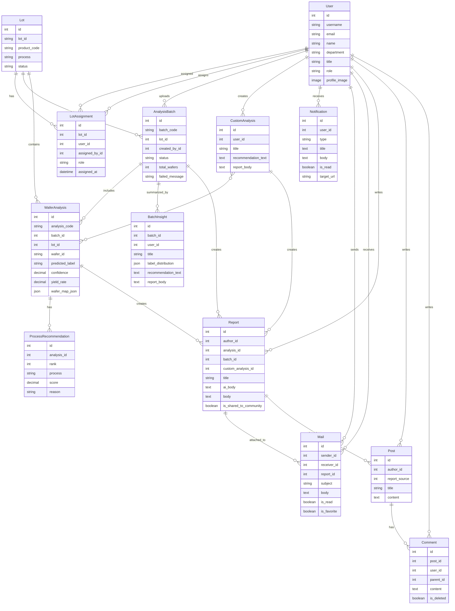
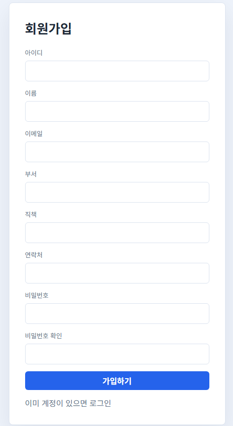
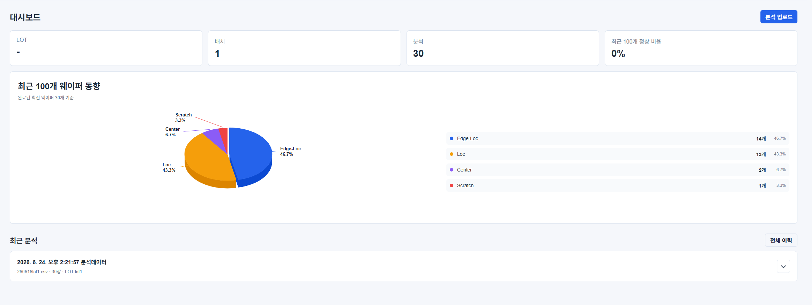
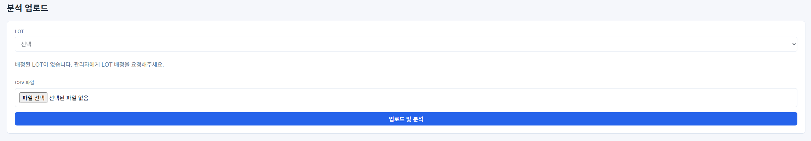
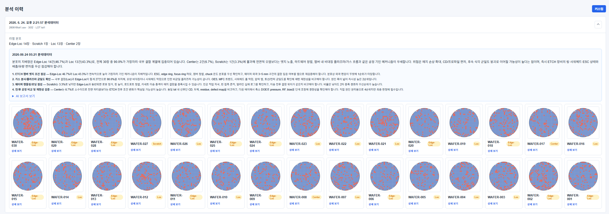
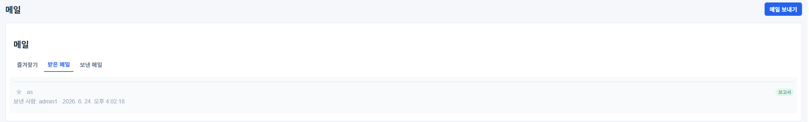
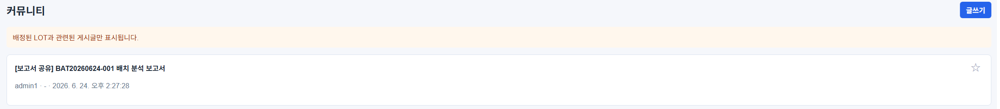
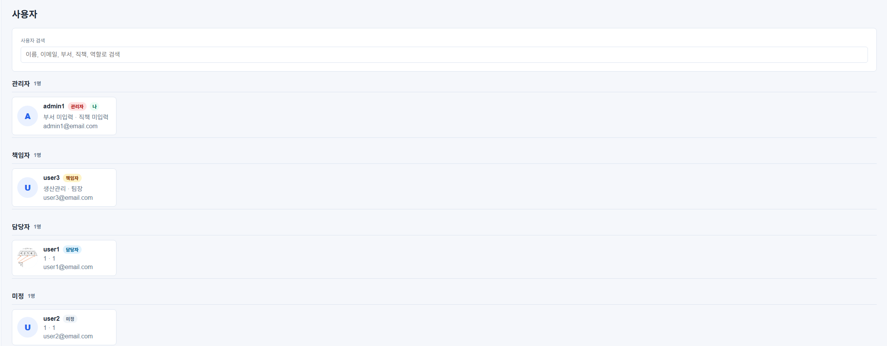
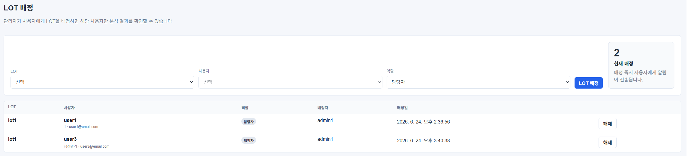

# Wafer Insight

Wafer Insight는 반도체 공정에서 발생하는 LINE 단위 웨이퍼 CSV 데이터를 분석하고, 분석 결과를 바탕으로 추천 공정, AI 보고서, 알림/메일, 커뮤니티 공유까지 연결하는 공정 분석 협업 서비스입니다.

관리자는 LINE을 사용자에게 배정할 수 있고, 일반 사용자는 자신에게 배정된 LINE의 분석 결과만 확인할 수 있습니다. 분석 결과는 보고서로 작성해 커뮤니티에 공유하거나 메일에 첨부해 다른 사용자에게 전달할 수 있습니다.

## 1. 프로젝트 개요

### 1.1 서비스 배경

반도체 제조 공정에서는 LINE 단위로 다수의 웨이퍼 검사 데이터가 발생합니다. 기존에는 CSV 파일과 웨이퍼맵 결과를 사람이 직접 확인하고, 분석 결과를 별도로 정리해 담당자에게 공유해야 했습니다. 이 과정은 시간이 오래 걸리고, 분석 결과와 보고서, 담당자 협업 흐름이 분리되어 있다는 문제가 있습니다.

Wafer Insight는 CSV 업로드 이후의 흐름을 자동화해 분석자가 웨이퍼맵 결과를 빠르게 확인하고, 추천 공정과 보고서 초안을 생성한 뒤 관련 담당자에게 공유할 수 있도록 설계했습니다.

### 1.2 주요 목표

- CSV 파일 기반 LINE/웨이퍼 분석 자동화
- 웨이퍼맵 시각화 및 결함 패턴 예측
- 수율 90% 이상 정상 처리 기준 적용
- CSV 파일 단위 추천 공정 제공
- GMS 기반 분석 결과 요약 및 보고서 작성 지원
- 알림, 메일, 커뮤니티를 통한 협업 흐름 제공
- 관리자 LINE 배정 기반 사용자별 분석 결과 조회 권한 관리

## 2. 팀 정보 및 업무 분담

| 이름 | 역할 | 담당 업무 |
| --- | --- | --- |
| 장윤우 | Backend / AI | Django API, CSV 분석 처리, 추천 공정 로직, DB 모델 설계 |
|       | Frontend | Vue 화면 구성, 분석 이력/상세 화면, 알림/메일 UI |
| 전주현 | Full Stack | 보고서, 커뮤니티, 권한 관리, 사용자 기능 통합 |
|       | 기획 / QA | 서비스 기획, 발표 자료, 테스트 시나리오, README 정리 |


## 3. 목표 서비스 및 구현 정도

| 목표 기능 | 구현 정도 | 설명 |
| --- | --- | --- |
| CSV 업로드 및 분석 | 구현 | CSV 파일을 업로드하면 LINE 단위 배치 분석이 생성되고 웨이퍼별 결과가 저장됩니다. |
| 폴더 감시 자동 분석 | 구현 | `LotData/incoming` 폴더에 CSV 파일을 넣으면 watcher가 자동으로 분석합니다. |
| 웨이퍼맵 시각화 | 구현 | 분석 상세 화면에서 웨이퍼맵 이미지와 예측 결과를 확인할 수 있습니다. |
| 분석 이력 관리 | 구현 | 분석 결과를 CSV 파일/배치 단위로 묶어 확인할 수 있습니다. |
| 수율 기준 정상 처리 | 구현 | 수율 90% 이상이면 정상 처리 기준을 적용합니다. |
| 추천 공정 | 구현 | 분석 결과와 결함 패턴, 신뢰도 등을 바탕으로 점검 공정을 추천합니다. |
| GMS 기반 보고서 | 구현 | 분석 결과 요약, 추천 공정 정리, 보고서 초안을 생성합니다. |
| 보고서 작성 및 업로드 | 구현 | 보고서를 작성하고 업로드 완료 창을 표시하며 커뮤니티에 공유합니다. |
| 알림/메일 | 구현 | 분석 완료, 댓글, LINE 배정, 메일 수신 등을 알림/메일로 확인합니다. |
| 메일 보고서 첨부 | 구현 | 메일 작성 시 보고서를 첨부하고, 메일 상세에서 보고서 상세로 이동할 수 있습니다. |
| 커뮤니티 | 구현 | 보고서 기반 게시글 공유, 댓글/답글, 즐겨찾기 기능을 제공합니다. |
| 권한 관리 | 구현 | 관리자가 LINE을 배정하고 일반 사용자는 배정된 LINE만 조회할 수 있습니다. |
| 사용자/프로필 | 구현 | 사용자 목록, 상세 프로필, 프로필 사진 업로드, 사용자별 메일 발송을 제공합니다. |
| 관리자 화면 커스터마이징 | 구현 | Django 관리자 로그인/상단/모델명/이동 주소를 프로젝트 UI에 맞게 수정했습니다. |
| 배포 | 미정 | 로컬 개발 환경 기준으로 구현했습니다. |

## 4. 기술 스택

### Frontend

- Vue 3
- Vue Router
- Vite
- Highcharts
- CSS

### Backend

- Django 5.2
- Django ORM
- SQLite

### AI / Analysis

- PyTorch
- TorchVision
- NumPy
- Pandas
- SciPy
- Pillow
- GMS API

### Collaboration

- 알림
- 메일
- 보고서 첨부 메일
- 커뮤니티
- 댓글/답글

## 5. 데이터베이스 모델링 ERD



## 6. 추천 알고리즘 설명

추천 공정 기능은 웨이퍼맵 분석 결과를 단순히 예측 라벨로 보여주는 것에서 끝나지 않고, 다음 점검 공정으로 이어질 수 있도록 설계했습니다.

### 6.1 입력 데이터

- CSV 파일 내 웨이퍼맵 데이터
- LINE 정보
- 웨이퍼 ID 및 공정 정보
- 분석 모델의 예측 라벨
- 예측 신뢰도
- 수율 정보

### 6.2 분석 흐름

1. CSV 파일을 파싱해 웨이퍼 단위 데이터를 추출합니다.
2. 각 웨이퍼맵을 분석 모델에 입력해 결함 패턴 라벨과 신뢰도를 계산합니다.
3. 수율이 90% 이상이면 정상 처리 기준을 우선 적용합니다.
4. 예측 라벨, 신뢰도, 수율, 공정 정보를 기반으로 점검이 필요한 공정을 추천합니다.
5. CSV 파일 또는 배치 단위로 주요 결함 패턴과 추천 공정을 요약합니다.
6. GMS API를 통해 분석 요약, 추천 사유, 보고서 초안을 생성합니다.

### 6.3 추천 기준

- 예측 신뢰도가 낮은 경우 추가 점검 필요로 분류
- 특정 결함 패턴이 반복될 경우 관련 공정 점검 우선순위 상승
- 수율이 기준 이하인 경우 공정 이상 가능성을 높게 판단
- 추천 공정에는 추천 이유와 위험도를 함께 제공합니다.

## 7. 핵심 기능 설명

### 7.1 CSV/LINE 기반 분석

사용자는 CSV 파일을 업로드해 LINE 단위 분석을 생성할 수 있습니다. 업로드된 CSV는 웨이퍼 단위로 파싱되고, 각 웨이퍼맵은 분석 모델을 통해 예측 라벨, 신뢰도, 수율, 추천 공정을 부여받습니다.

### 7.2 분석 이력 및 상세 조회

분석 이력 화면에서는 CSV 파일 또는 배치 단위로 분석 결과를 확인할 수 있습니다. 사용자는 특정 배치를 펼쳐 웨이퍼별 이미지, 예측 결과, 정상 여부, 보고서 작성 버튼을 확인할 수 있습니다.

### 7.3 수율 기반 정상 처리

수율이 90% 이상인 웨이퍼는 정상 처리 기준으로 판단합니다. 이를 통해 분석자는 우선적으로 점검해야 하는 이상 웨이퍼를 빠르게 구분할 수 있습니다.

### 7.4 커스텀 분석

분석자는 원하는 웨이퍼를 직접 선택해 커스텀 분석을 생성할 수 있습니다. 서로 다른 CSV의 웨이퍼도 묶어 분석할 수 있으며, 선택된 웨이퍼 기준으로 GMS 요약과 보고서를 생성할 수 있습니다.

### 7.5 보고서 작성 및 업로드

분석 결과를 바탕으로 보고서 초안을 작성하고 업로드할 수 있습니다. 업로드가 완료되면 완료 창을 표시하고, 보고서는 커뮤니티에 공유됩니다.

### 7.6 알림/메일

알림과 메일은 화면 오른쪽 상단 아이콘에서 확인할 수 있습니다. 알림 제목을 누르면 관련 분석 또는 배치 페이지로 이동하며, 읽은 알림은 알림 개수에서 제외됩니다.

메일은 받은 메일, 보낸 메일, 즐겨찾기 메일로 구분됩니다. 메일 상세에서 읽음 처리, 삭제, 답장, 즐겨찾기, 첨부 보고서 확인이 가능합니다.

### 7.7 보고서 첨부 메일

메일 작성 시 접근 가능한 보고서를 첨부할 수 있습니다. 첨부된 보고서는 메일 상세에서 확인할 수 있으며, 보고서 제목을 클릭하면 보고서 상세 페이지로 이동합니다.

### 7.8 커뮤니티

보고서를 커뮤니티에 공유하고 댓글과 답글을 작성할 수 있습니다. 본인 게시글에 댓글이 달리면 알림이 생성됩니다. 일반 사용자는 본인에게 배정된 LINE과 관련된 게시글만 볼 수 있습니다.

### 7.9 관리자 LINE 배정

관리자는 서비스 내부 `LINE 배정` 페이지에서 사용자에게 LINE을 배정할 수 있습니다. 역할은 책임자와 담당자로 구분됩니다. 일반 사용자는 배정된 LINE의 분석 결과만 조회할 수 있습니다.

### 7.10 사용자 및 프로필

사용자 페이지에서는 관리자, 책임자, 담당자, 미정 순서로 사용자 목록을 확인할 수 있습니다. 본인 카드에는 `나` 배지가 표시됩니다. 사용자 상세 프로필에서는 해당 사용자에게 바로 메일을 보낼 수 있습니다.

프로필 페이지에서는 기본적으로 정보를 조회하고, 수정 버튼을 누르면 이름, 이메일, 부서, 직책, 연락처, 프로필 사진을 수정할 수 있습니다.

## 8. 생성형 AI 사용 부분

본 프로젝트에서는 GMS API를 분석 결과 해석과 보고서 작성 보조에 사용했습니다.

### 8.1 분석 결과 요약

웨이퍼 분석 결과, 주요 결함 패턴, 수율, 신뢰도 정보를 바탕으로 사람이 읽기 쉬운 요약 문장을 생성합니다.

### 8.2 추천 공정 설명

추천 공정이 도출된 이유를 자연어로 정리해 분석자가 결과를 이해하기 쉽게 돕습니다.

### 8.3 보고서 초안 작성

분석 결과와 추천 공정 정보를 바탕으로 보고서 초안을 생성합니다. 사용자는 초안을 검토하고 필요한 내용을 수정해 최종 보고서로 업로드할 수 있습니다.

## 9. 서비스 URL

로컬 실행 기준 주소입니다.

- 프론트엔드: `http://127.0.0.1:5173`
- 백엔드: `http://127.0.0.1:8000`
- 관리자 페이지: `http://127.0.0.1:8000/admin/`

배포 시에는 아래 항목을 실제 배포 주소로 변경합니다.

- 서비스 URL: 배포 후 기입
- 관리자 계정: 제출 시 필요하면 별도 기입
- 테스트 계정: 제출 시 필요하면 별도 기입

## 10. 실행 방법

### 10.1 Backend 실행

```powershell
cd C:\Users\SSAFY\Documents\Codex\2026-06-22\d\work\6-23
python -m venv venv
.\venv\Scripts\activate
pip install -r requirements.txt
python manage.py migrate
python manage.py createsuperuser
python manage.py runserver
```

### 10.2 Frontend 실행

새 터미널에서 실행합니다.

```powershell
cd C:\Users\SSAFY\Documents\Codex\2026-06-22\d\work\6-23
npm install
npm run dev
```

### 10.3 CSV 자동 분석 watcher 실행

```powershell
cd C:\Users\SSAFY\Documents\Codex\2026-06-22\d\work\6-23
.\venv\Scripts\activate
python manage.py watch_lot_folder
```

### 10.4 실행 시 주의사항

로컬 개발 시 보통 세 개의 터미널을 사용합니다.

```powershell
python manage.py runserver
npm run dev
python manage.py watch_lot_folder
```

최근 DB 필드가 추가되었으므로 새 환경에서는 반드시 마이그레이션을 실행해야 합니다.

```powershell
python manage.py migrate
```

프론트에서 아래 오류가 보이면 Django 서버가 꺼진 상태입니다.

```text
[vite] http proxy error
connect ECONNREFUSED 127.0.0.1:8000
```

해결:

```powershell
python manage.py runserver
```


## 11. 환경 변수

`.env` 파일에서 다음 값을 설정할 수 있습니다.

```env
DJANGO_SECRET_KEY=dev-wafer-insight-secret-key
DJANGO_DEBUG=1
DJANGO_ALLOWED_HOSTS=127.0.0.1,localhost
DJANGO_CSRF_TRUSTED_ORIGINS=http://127.0.0.1:5173,http://localhost:5173

WAFER_MODEL_PATH=models/best_radai_resnet.pt
LOW_CONFIDENCE_THRESHOLD=0.85

GMS_API_URL=https://gms.ssafy.io/gmsapi/api.openai.com/v1/chat/completions
GMS_KEY=
GMS_MODEL=gpt-5.4-mini
GMS_TIMEOUT=45
```

Vite 프록시 대상은 기본적으로 `http://127.0.0.1:8000`입니다. 필요하면 `VITE_DJANGO_API_URL`로 변경할 수 있습니다.

## 12. CSV 형식

필수 컬럼:

- `lot_id`
- `wafer_map`

권장 컬럼:

- `wafer_id`
- `wafer_index`
- `process`
- `step`
- `equipment_id`
- `recipe_id`
- `inspection_time`
- `die_size`
- `yield_rate`

예시:

```csv
lot_id,wafer_id,wafer_index,process,step,equipment_id,recipe_id,inspection_time,die_size,yield_rate,wafer_map
LOT20260617-DEMO,WAFER-001,1,ETCH,POST_ETCH,ETCH-03,RCP-ETCH-A,2026-06-17 09:30:00,1683,91.2,"[[0,0,0],[0,1,2],[0,0,0]]"
```

주의사항:

- CSV의 `lot_id`는 DB에 등록된 LINE과 일치해야 합니다.
- 일반 사용자는 본인에게 배정된 LINE만 업로드할 수 있습니다.
- `wafer_map`은 2차원 배열 형태여야 합니다.

## 13. 주요 화면

| 경로 | 설명 |
| --- | --- |
| `/` | 대시보드 |
| `/analyses/upload/` | CSV 분석 업로드 |
| `/analyses/history/` | CSV/배치별 분석 이력 |
| `/analyses/:id/` | 웨이퍼 분석 상세 |
| `/community/` | 커뮤니티 |
| `/mails/` | 메일함 |
| `/notifications/` | 알림 |
| `/accounts/profile/` | 내 프로필 |
| `/accounts/users/` | 사용자 목록 |
| `/accounts/users/:id/` | 사용자 상세 프로필 |
| `/management/lot-assignments/` | LINE 배정 |
| `/reports/:id/` | 보고서 상세 |

## 14. 실행 화면 캡처

제출 시 실제 실행 화면 캡처 이미지를 추가합니다. 캡처 이미지는 `docs/images` 폴더에 저장하고, README에서는 동일한 폭으로 표시해 간격을 맞춥니다.

### 14.1 로그인 / 회원가입

<p align="left">
  
</p>

<p align="left">
  
</p>

### 14.2 대시보드

<p align="left">
  
</p>

### 14.3 CSV 업로드

<p align="left">
  
</p>

### 14.4 분석 이력

<p align="left">
  
</p>

### 14.5 분석 상세 및 웨이퍼맵

<p align="left">
  
</p>

### 14.6 추천 공정 / 보고서 작성

<p align="left">
  
</p>

### 14.7 알림 / 메일

<p align="left">
  
</p>

### 14.8 커뮤니티

<p align="left">
  
</p>

### 14.9 사용자 목록 / LINE 배정

<p align="left">
  
</p>

<p align="left">
  
</p>

## 15. 프로젝트 진행 중 학습한 내용

- Django 모델 관계 설계와 권한 기반 조회 처리
- CSV 파일 파싱 및 웨이퍼맵 데이터 전처리
- 분석 결과를 사용자 화면에 맞게 직관적으로 표현하는 방법
- Vue Router를 활용한 목록/상세 페이지 분리
- 알림/메일 읽음 처리 및 사용자별 데이터 분리
- 보고서, 커뮤니티, 메일 첨부를 연결하는 협업 흐름 설계
- GMS API를 분석 결과 요약과 보고서 작성에 연결하는 방법

## 16. 어려웠던 부분

- CSV 파일 구조가 달라질 수 있어 안정적으로 파싱하는 처리
- 분석 결과를 웨이퍼 단위와 CSV 파일 단위로 함께 보여주는 화면 구성
- 관리자와 일반 사용자의 LINE 접근 권한을 명확히 분리하는 로직
- 커뮤니티, 보고서, 메일 첨부에서도 동일한 권한 정책을 유지하는 처리
- 생성형 AI 결과를 그대로 사용하는 것이 아니라 보고서 초안으로 자연스럽게 연결하는 흐름 설계

## 17. 새로 배운 점 및 느낀 점

이번 프로젝트를 통해 단순히 분석 모델 결과를 출력하는 것보다, 실제 사용자가 그 결과를 어떻게 확인하고 다음 행동으로 이어갈 수 있는지가 중요하다는 점을 배웠습니다.

CSV 업로드, 웨이퍼 분석, 추천 공정, 보고서 작성, 알림과 커뮤니티 공유까지 하나의 흐름으로 연결하면서 데이터 분석 서비스도 업무 협업 구조와 함께 설계되어야 한다는 점을 경험했습니다.

또한 관리자와 일반 사용자의 권한을 LINE 기준으로 분리하고, 커뮤니티와 메일 첨부에서도 같은 권한 정책을 유지하는 과정에서 실제 서비스에서 데이터 접근 권한이 매우 중요한 요소라는 점을 배웠습니다.

## 18. 향후 개선 방향

- 대시보드 고도화
- 분석 실패 알림 및 실패 사유 표시 강화
- 실시간 알림 기능 고도화
- 다양한 웨이퍼 결함 패턴 학습
- GMS 연동 범위 확장
- 보고서 템플릿 다양화
- 실제 설비/공정 데이터 연동
- 배포 환경 구성


